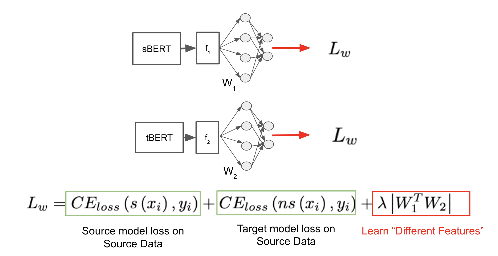

# Pseudo-Label-Domain-Adaptation-NLP
[Unofficial] Implementation of Pseudo-Label Guided Unsupervised Domain Adaptation of Contextual Embeddings (Second Workshop on Domain Adaptation for NLP, ACL-IJCNLP 2021)

The official paper can be found here - <a href="https://aclanthology.org/2021.adaptnlp-1.2/">Pseudo-Label Guided Unsupervised Domain Adaptation of Contextual Embeddings</a>. This implementation for text classification.

# Table of Contents

1. [(Inspired) Asymmetric Tri-training Adaptation Method](#inspired-asymmetric-tri-training-adaptation-method)
2. [Data Format](#data-format)
3. [Running](#running)
4. [Custom Source and Target Models](#custom-source-and-target-models)
5. [Citation for original paper](#citation-for-original-paper)


## (Inspired) Asymmetric Tri-training Adaptation Method
*<p style="text-align: center;">Figure 1: A visualization of the Joint-Finetuning Step in the paper (not from paper; self-created)</p>*

The <a href = "https://aclanthology.org/2021.adaptnlp-1.2/">paper</a> proposes joint-finetuning of the source BERT (sBERT) and the target BERT (tBERT) models on the labeled source data. They add an additional term to the loss function inspired by the <a href = "https://arxiv.org/abs/1702.08400">Asymmetric Tri-training Adaptation Method</a>. <br>

<b> Key Idea </b> <br>
We are forcing the models to learn with "different" features from each other. If they still agree on the label, then it can be the correct one.

<b> How are we adding "different" features constraint? </b> <br>
By adding a third term in the loss function. The term is the matrix multiplication of the weights $W_1$ and $W_2$. They are the weights of the first layer (refer figure 1) after the sBERT and the tBERT model respectively. 


## Data Format 

There is no data shared for this repository at the moment. You can load a dataset by creating a ```data``` folder and creating a directory structure as follows - 

```bash
data
├── labeled
  └── source_test.csv 
  └── source_train.csv 
  └── source_val.csv 
  └── target_test.csv 
  └── target_train.csv 
  └── target_val.csv 
``` 

The format of ```source_test.csv``` should be as follows - 

sentence &emsp;&emsp;&emsp;&emsp;&emsp;  label <br>
The Good Place &emsp;&emsp;&nbsp;&nbsp;  1 <br>
Breaking Bad     &emsp;&emsp;&emsp;&nbsp;&nbsp;&nbsp;  0 <br>
........


## Running 
<br>


```
pip3 install -r requirements.txt
cd code/model/
python3 train_eval.py
```

For now, the sBERT and tBERT have been initialized to the same value -> "bert-base-uncased". <br>


After running the ```train_eval.py``` file, the results will be stored in the ```results``` folder. <br>
```bash
results
├── source_BERT
  ├── model_name2 (parameter in train_eval.py)
    ├── min_nf_tokens (parameter in train_eval.py)
      ├── model_weights
      ├── models
      ├── predictions
      ├── results
├── target_BERT
  ├── model_name1 (parameter in train_eval.py)
    ├── min_nf_tokens (parameter in train_eval.py)
      ├── model_weights
      ├── models
      ├── predictions
      ├── results

``` 

## Custom Source and Target Models 
<br>

You can upload a custom BERT/RoBERTa by changing the model_path1 and model_path2 variables in the ```train_eval.py```. <br>

```
model_path1 = "bert-base-uncased"
model_name2 = "bert-base-uncased"
```

<b>NOTE</b> - model1 corresponds to the target model and model2 corresponds to the source model.

Both the models use the same BERT ("bert-base-uncased") tokenizer for now.

## Citation for original paper

```
@inproceedings{chen-etal-2021-pseudo,
    title = "Pseudo-Label Guided Unsupervised Domain Adaptation of Contextual Embeddings",
    author = "Chen, Tianyu  and
      Huang, Shaohan  and
      Wei, Furu  and
      Li, Jianxin",
    booktitle = "Proceedings of the Second Workshop on Domain Adaptation for NLP",
    month = apr,
    year = "2021",
    address = "Kyiv, Ukraine",
    publisher = "Association for Computational Linguistics",
    url = "https://aclanthology.org/2021.adaptnlp-1.2",
    pages = "9--15",
    abstract = "Contextual embedding models such as BERT can be easily fine-tuned on labeled samples to create a state-of-the-art model for many downstream tasks. However, the fine-tuned BERT model suffers considerably from unlabeled data when applied to a different domain. In unsupervised domain adaptation, we aim to train a model that works well on a target domain when provided with labeled source samples and unlabeled target samples. In this paper, we propose a pseudo-label guided method for unsupervised domain adaptation. Two models are fine-tuned on labeled source samples as pseudo labeling models. To learn representations for the target domain, one of those models is adapted by masked language modeling from the target domain. Then those models are used to assign pseudo-labels to target samples. We train the final model with those samples. We evaluate our method on named entity segmentation and sentiment analysis tasks. These experiments show that our approach outperforms baseline methods.",
}
```

## 👪 Contributing
Pull requests are welcome. For major changes, please open an issue first to discuss what you would like to change. For any detailed clarifications/issues, please email to nirdiwan[at]gmail[dot]com.

<!-- ## ⚖️ License
[MIT](https://choosealicense.com/licenses/mit/) -->
